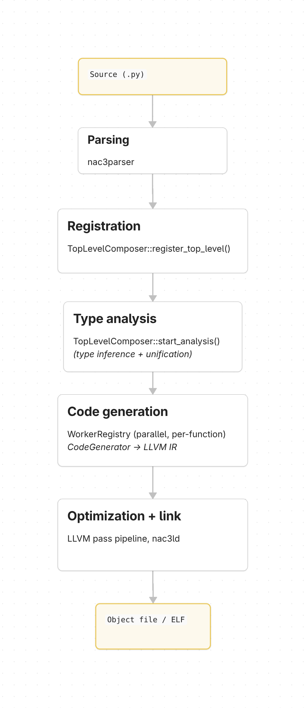

# Architecture

NAC3 follows a classic compiler pipeline: parse, analyze, generate. The codebase is split into several Rust crates that separate concerns cleanly enough that `nac3core` contains nothing specific to ARTIQ.

## Crate Layout
| Crate          |                                                                                               |
| -------------- | --------------------------------------------------------------------------------------------- |
| nac3ast        | Python AST node definitions (based on [RustPython](https://github.com/RustPython/RustPython)) |
| nac3parser     | Lexer + LALRPOP parser producing nac3ast trees                                                |
| nac3core       | Type checking, type inference, LLVM code generation                                           |
| nac3artiq      | ARTIQ frontend - Python/PyO3 integration, timeline, RPC                                    |
| nac3standalone | Minimal frontend - compiles a .py file to an object file                                      |
| nac3binutils   | Linker (nac3ld), symbolizer, DWARF utilities                                                  |
| runkernel      | Test harness that runs compiled ARTIQ kernels on the host                                     |

`nac3core` is where most of the compiler lives. It is intentionally frontend-agnostic: the two frontends (`nac3artiq` and `nac3standalone`) plug in through a small set of traits described below.

## Compilation Pipeline

A complete compilation proceeds in five stages. The frontends drive the first and last stages; `nac3core` owns everything in between.

### Stage 1: Parsing

`nac3parser` tokenizes Python source and feeds it into a LALRPOP-generated parser. The output is a `Vec<Stmt>`; a list of top-level AST statements from `nac3ast`. The parser is a lightly modified fork of RustPython's parser.

### Stage 2: Registration

The frontend walks the parsed statements and registers each class and function with `TopLevelComposer::register_top_level()`. This populates the global definition list with `TopLevelDef::Class` and `TopLevelDef::Function` entries, each identified by a `DefinitionId` (a plain `usize` index).

Assignments at module scope are handled separately by the frontend, typically to register `TypeVar` and `ConstGeneric` declarations or module-level constants.

### Stage 3: Type Analysis

`TopLevelComposer::start_analysis()` processes all registered definitions:

1. Resolves type annotations (inheritance, field types, method signatures).
2. Runs the type inferencer on every function body.
3. Unifies type constraints using a union-find based `Unifier`.

After this stage the AST is annotated: every expression node carries an `Option<Type>` indicating its inferred type. `Type` is a `UnificationKey`: a lightweight handle into the unification table, not a concrete description. To inspect what a `Type` actually is, you query the `Unifier` for its `TypeEnum`.

The important `TypeEnum` variants are:

- `TObj`: a class instance, carrying its `DefinitionId`, field map, and type parameter bindings.
- `TFunc`: a function signature (argument types, return type, type variables).
- `TVar`: an unconstrained or range-constrained type variable, resolved during unification.
- `TRigidVar`: a type variable that must not be unified further (appears in generic class/function definitions).
- `TTuple`, `TLiteral`, `TVirtual`, `TCall`: tuples, literal types, virtual dispatch wrappers, and unresolved call sites respectively.

### Stage 4: Code Generation

Code generation is parallel and demand-driven. The frontend creates a `WorkerRegistry` with N worker threads, each owning a `CodeGenerator` and an independent LLVM `Context`.

The entry point function is submitted as a `CodeGenTask`. When a worker picks up a task, it generates LLVM IR for that function. If the function calls another generic function with concrete type arguments that has not been compiled yet, a new `CodeGenTask` is created and placed on the shared work queue. This continues until no more tasks remain.

Each task carries:

- The function body (typed AST).
- A `ConcreteTypeStore` with monomorphized types for this instantiation.
- Type substitutions mapping type variables to their concrete types.
- A `SymbolResolver` for looking up external names.

The per-function context is `CodeGenContext`, which holds the LLVM builder, variable assignments, type caches, and control-flow state (loop targets, unwind targets, return buffer). It derefs to `ModuleContext`, which holds the LLVM module and target-specific type information.

After all workers finish, the frontend links the per-worker LLVM modules together, links in the IRRT (runtime library), runs the LLVM optimization pipeline, and emits the final object file.

### Stage 5: Optimization and Linking

The merged LLVM module is run through LLVM's new pass manager. The pass string typically looks like `globaldce,strip-dead-prototypes,default<O2>`. After optimization, the target machine emits an object file. For ARTIQ, `nac3ld` performs final linking to produce an ELF suitable for loading onto the core
device.

## Frontend Integration Points

Frontends customize the compiler through four traits and one callback:

**`SymbolResolver`**: maps identifiers to types and values. The frontend implements this to bridge its own name resolution (Python runtime objects in nac3artiq, a simple hash map in nac3standalone) into `nac3core`'s type system. Key methods: `get_symbol_type()`, `get_identifier_def()`, `get_symbol_value()`.

**`CodeGenerator`**: controls IR generation for expressions, statements, calls, and control flow. `DefaultCodeGenerator` provides the standard implementation; `ArtiqCodeGenerator` overrides `gen_with()` and `gen_call()` to handle `with parallel` blocks and timeline manipulation.

**`BuiltinRegistry`**: determines how AST expressions are matched to builtin type/function definitions. `DefaultBuiltinRegistry` matches by name strings; nac3artiq's `ArtiqBuiltinRegistry` matches by Python object identity (via PyO3).

**`TimeFns`**: (nac3artiq only) emits LLVM IR for `now_mu()`, `at_mu()`, and `delay_mu()`. Implementations differ by target ISA (VexRiscv with 32-bit or 64-bit data bus, or external function calls for host execution).

**`GenCall`**: a callback stored on `TopLevelDef::Function` that overrides code generation for specific functions. nac3artiq uses this for RPC stubs, where the generated code must serialize arguments and invoke the host runtime instead of calling a compiled function.

## nac3standalone

The standalone frontend is a command-line tool that compiles a single Python file to an object file. It expects a `run()` function as the entry point. The implementation is under 500 lines and serves as the reference for how to drive `nac3core`.

The compilation flow:

1. Parse the input file.
2. Create a `TopLevelComposer` with `DefaultBuiltinRegistry`.
3. Register all top-level definitions; handle `TypeVar`/`ConstGeneric` assignments separately.
4. Run `start_analysis()`.
5. Look up the `run` function, create a `CodeGenTask` for it.
6. Spawn `WorkerRegistry` threads with `DefaultCodeGenerator`.
7. Link modules, optimize, write `module.o`.

## nac3artiq

The ARTIQ frontend is a Python extension module (built as a `cdylib` via PyO3). It is loaded by the ARTIQ runtime and compiles `@kernel` functions on demand.

Key differences from the standalone frontend:

- **Python interop**: `InnerResolver` implements `SymbolResolver` by inspecting live Python objects through PyO3. Class fields, method signatures, and default parameter values are all extracted from the Python runtime.
- **Decorators**: `@kernel`, `@portable`, `@rpc`, and `@extern` mark functions for different compilation strategies. `@rpc` functions get a `GenCall` callback that generates serialization/deserialization code instead of a normal function body.
- **Parallel blocks**: `with parallel` and `with sequential` are context managers that manipulate the RTIO timeline. `ArtiqCodeGenerator` overrides `gen_with()` to track timeline positions and reset/advance the cursor appropriately.
- **Timeline**: The `TimeFns` trait abstracts over different hardware targets.`NowPinningTimeFns64` directly reads/writes split 32-bit CSR registers on VexRiscv; `ExternTimeFns` calls out to external C functions for host-mode execution.
- **Target ISAs**: nac3artiq can target `riscv32-unknown-linux` (Kasli/core device), `armv7-unknown-linux-eabihf` (Zynq), or the host triple.
- **Attribute writeback**: After compilation, mutable object attributes may need to be written back to the Python runtime. This is handled by `attributes_writeback()`.

## IRRT (Inline Runtime)

The IRRT is a small runtime library written in C++ under `nac3core/irrt/`. It provides helper functions for operations that are too complex to emit inline (integer exponentiation, range slicing, string operations, list helpers, etc.).

The build process (in `nac3core/build.rs`):

1. Compile `irrt.cpp` to LLVM IR using `clang-irrt` targeting `wasm32` (to get target-independent IR).
   [TODO]: stale — build now compiles BOTH wasm32 and wasm64 to `irrt32.ll`/`irrt64.ll`, not wasm32-only to `irrt.ll`
2. Filter the IR with regexes to keep only function definitions, declarations, type definitions, and globals.
3. Strip debug metadata.
4. Embed the IR via `include_bytes!()`.

At compile time, `load_irrt()` parses this embedded IR into an LLVM module and initializes exception ID globals. The module is then linked into the final output.

To debug IRRT issues, set `DEBUG_DUMP_IRRT=1` when building nac3core. This writes `irrt.ll` (raw) and `irrt-filtered.ll` (after regex filtering) to the build output directory.
